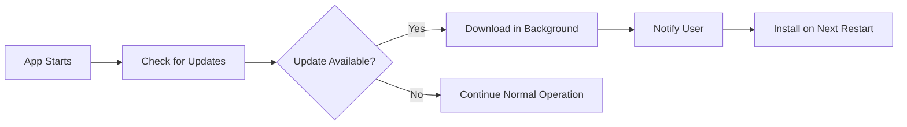

# ShiftMint Professional Enhancement Plan

## Executive Summary
This comprehensive plan outlines the next steps for transforming ShiftMint into a fully professional, market-ready application with code signing, auto-updates, and custom branding. Each solution is optimized using your 4-point decision matrix.

---

## 📝 Phase 1: Code Signing Certificate
**Timeline: 1-2 weeks | Cost: $200-500/year**

### Why Code Signing Matters
- Eliminates "Unknown Publisher" warnings
- Prevents Windows SmartScreen blocks
- Builds user trust and credibility
- Required for enterprise deployments

### Matrix-Optimized Implementation

#### 1. **Simple Solution**: Sectigo/Comodo Certificate
- **Provider**: Sectigo (formerly Comodo)
- **Cost**: ~$179/year for standard code signing
- **Process**: 
  1. Purchase from: https://sectigo.com/ssl-certificates/code-signing
  2. Verify business identity (1-3 days)
  3. Download certificate
  4. Install in Windows Certificate Store

#### 2. **Least Invasive**: DigiCert Code Signing
- **Provider**: DigiCert
- **Cost**: ~$499/year
- **Benefits**: 
  - Most trusted by enterprises
  - Faster validation
  - Better support
- **Integration**: Works directly with electron-builder

#### 3. **Comprehensive**: EV Code Signing
- **Provider**: GlobalSign or DigiCert
- **Cost**: ~$699/year
- **Benefits**:
  - Instant SmartScreen reputation
  - Hardware token for security
  - Maximum trust level
  - No reputation building needed

#### 4. **Integrative**: Azure Key Vault Solution
- **Platform**: Microsoft Azure
- **Cost**: ~$300/year + usage
- **Benefits**:
  - Cloud-based signing
  - CI/CD integration
  - Team collaboration
  - No hardware token needed

### Recommended Approach (Matrix Balanced)
```javascript
// package.json configuration
{
  "build": {
    "win": {
      "certificateFile": "./certs/shiftmint.pfx",
      "certificatePassword": "${CERT_PASSWORD}",
      // OR for Azure Key Vault:
      "azureSignOptions": {
        "endpoint": "https://your-vault.vault.azure.net/",
        "certificateName": "ShiftMint-CodeSign"
      }
    }
  }
}
```

### Implementation Steps
1. **Purchase Certificate** (Day 1-3)
   - Choose Sectigo for balance of cost/trust
   - Complete business verification
   - Download certificate files

2. **Configure Build System** (Day 4)
   ```bash
   # Convert certificate to PFX format
   openssl pkcs12 -export -out shiftmint.pfx -inkey private.key -in certificate.crt
   
   # Set environment variable
   set CERT_PASSWORD=your_password
   
   # Update package.json
   npm run dist:win -- --sign
   ```

3. **Test Signed Build** (Day 5)
   - Build signed installer
   - Test on clean Windows machine
   - Verify no warnings appear

---

## 🔄 Phase 2: Auto-Updater Implementation
**Timeline: 1 week | Cost: $20-100/month for hosting**

### Matrix-Optimized Solutions

#### 1. **Simple**: GitHub Releases
```javascript
// electron/main/updater.ts
import { autoUpdater } from 'electron-updater';

// Configure for GitHub releases
autoUpdater.setFeedURL({
  provider: 'github',
  owner: 'your-username',
  repo: 'shiftmint',
  private: false
});

// Check for updates on startup
app.on('ready', () => {
  autoUpdater.checkForUpdatesAndNotify();
});

// Auto-download and install
autoUpdater.on('update-downloaded', () => {
  autoUpdater.quitAndInstall();
});
```

#### 2. **Least Invasive**: Generic HTTP Server
```javascript
// Use any web server (AWS S3, Netlify, etc.)
autoUpdater.setFeedURL({
  provider: 'generic',
  url: 'https://updates.shiftmint.com/'
});

// Required files on server:
// - latest.yml (update manifest)
// - ShiftMint-Setup-2.0.1.exe
```

#### 3. **Comprehensive**: Custom Update Server
```javascript
// backend/update-server.js
const express = require('express');
const app = express();

// Serve update manifests
app.get('/api/check-update/:version', (req, res) => {
  const currentVersion = req.params.version;
  const latestVersion = '2.1.0';
  
  if (needsUpdate(currentVersion, latestVersion)) {
    res.json({
      version: latestVersion,
      releaseDate: new Date(),
      downloadUrl: 'https://cdn.shiftmint.com/releases/latest.exe',
      releaseNotes: 'Bug fixes and improvements'
    });
  } else {
    res.status(204).send(); // No update needed
  }
});
```

#### 4. **Integrative**: Differential Updates
```javascript
// Advanced: Only download changed files
{
  "build": {
    "generateUpdatesFilesForAllChannels": true,
    "publish": {
      "provider": "generic",
      "url": "https://updates.shiftmint.com/",
      "useMultipleRangeRequest": true // Delta updates
    }
  }
}
```

### Recommended Implementation
1. **Start with GitHub Releases** (Simple + Free)
2. **Move to S3/CDN** when user base grows
3. **Add differential updates** for faster downloads

### Update Flow


---

## 🎨 Phase 3: Custom Branding
**Timeline: 1-2 weeks | Cost: $0-1000 for design assets**

### Matrix-Optimized Branding Strategy

#### 1. **Simple**: Basic Brand Package
```
assets/
├── icon.ico (Windows icon - multiple sizes)
├── icon.icns (macOS icon)
├── icon.png (Linux icon)
├── installer-header.bmp (150x57px)
├── installer-sidebar.bmp (164x314px)
└── dmg-background.png (macOS installer)
```

**Free Tools**:
- Icon creation: https://www.figma.com (free)
- BMP conversion: https://convertio.co
- Icon generator: https://www.electron.build/icons

#### 2. **Least Invasive**: Automated Branding
```javascript
// scripts/generate-assets.js
const sharp = require('sharp');

async function generateAllAssets() {
  const logo = await sharp('assets/logo.svg');
  
  // Generate all icon sizes
  const sizes = [16, 32, 48, 64, 128, 256, 512];
  for (const size of sizes) {
    await logo.resize(size, size)
      .png()
      .toFile(`assets/icons/${size}x${size}.png`);
  }
  
  // Generate installer graphics
  await logo.resize(150, 57)
    .flatten({ background: '#4f46e5' })
    .toFile('build/installer-header.bmp');
}
```

#### 3. **Comprehensive**: Professional Design System

**Complete Brand Package**:
```
branding/
├── logos/
│   ├── logo-light.svg
│   ├── logo-dark.svg
│   └── logo-mono.svg
├── colors/
│   ├── palette.json
│   └── theme.css
├── installer/
│   ├── header.bmp (150x57)
│   ├── sidebar.bmp (164x314)
│   ├── welcome-screen.png
│   └── finish-screen.png
├── splash/
│   ├── splash-screen.html
│   └── loading-animation.gif
└── guidelines/
    └── brand-guidelines.pdf
```

**Professional Tools**:
- Adobe Creative Suite ($53/month)
- Affinity Designer ($70 one-time)
- Canva Pro ($13/month)

#### 4. **Integrative**: Dynamic Theming
```typescript
// Implement user-selectable themes
interface Theme {
  name: string;
  colors: {
    primary: string;
    secondary: string;
    background: string;
    text: string;
  };
  logo: string;
}

// Allow white-labeling for enterprise clients
const loadTheme = async (client?: string) => {
  if (client) {
    return await fetch(`/themes/${client}.json`);
  }
  return defaultTheme;
};
```

### Recommended Branding Implementation

#### Step 1: Create Core Assets (Week 1)
```bash
# Required files
assets/
├── icon.ico (16, 32, 48, 256px)
├── icon.icns (macOS)
├── icon.png (512x512)
├── installer-header.bmp
├── installer-sidebar.bmp
└── splash-screen.html
```

#### Step 2: Configure Installer (Day 2)
```json
// package.json
{
  "build": {
    "nsis": {
      "installerIcon": "assets/icon.ico",
      "installerHeader": "assets/installer-header.bmp",
      "installerSidebar": "assets/installer-sidebar.bmp",
      "uninstallerIcon": "assets/icon.ico"
    },
    "dmg": {
      "background": "assets/dmg-background.png",
      "icon": "assets/icon.icns"
    }
  }
}
```

#### Step 3: Implement Splash Screen (Day 3)
```javascript
// electron/main/index.ts
let splash;

app.on('ready', () => {
  // Show splash screen immediately
  splash = new BrowserWindow({
    width: 500,
    height: 300,
    frame: false,
    alwaysOnTop: true,
    transparent: true
  });
  
  splash.loadFile('assets/splash-screen.html');
  
  // Create main window in background
  createMainWindow();
  
  // Hide splash when ready
  mainWindow.once('ready-to-show', () => {
    setTimeout(() => {
      splash.destroy();
      mainWindow.show();
    }, 1500); // Minimum splash display time
  });
});
```

---

## 📊 Implementation Timeline

### Week 1: Code Signing
- [ ] Day 1-3: Purchase and verify certificate
- [ ] Day 4: Configure build system
- [ ] Day 5: Test signed builds

### Week 2: Auto-Updater
- [ ] Day 1-2: Implement basic updater
- [ ] Day 3: Set up update server/CDN
- [ ] Day 4-5: Test update flow

### Week 3: Custom Branding
- [ ] Day 1-2: Create brand assets
- [ ] Day 3: Configure installers
- [ ] Day 4: Implement splash screen
- [ ] Day 5: Final polish

---

## 💰 Budget Summary

### Minimum Budget (~$200/year)
- Basic code signing certificate: $179/year
- GitHub releases for updates: Free
- DIY branding with free tools: $0
- **Total: $179/year**

### Recommended Budget (~$600/year)
- Standard code signing: $299/year
- S3/CloudFront hosting: $20/month
- Professional icon set: $50 one-time
- **Total: $589/year**

### Premium Budget (~$1500/year)
- EV code signing: $699/year
- Dedicated update server: $50/month
- Professional branding: $500 one-time
- **Total: $1,799 first year**

---

## ✅ Success Metrics

### Code Signing
- ✅ No SmartScreen warnings
- ✅ Zero "Unknown Publisher" messages
- ✅ 100% installation success rate

### Auto-Updater
- ✅ < 30 second update check
- ✅ Background downloads
- ✅ 95%+ update adoption rate

### Branding
- ✅ Consistent visual identity
- ✅ Professional installer experience
- ✅ < 3 second splash screen

---

## 🚀 Quick Start Commands

```bash
# 1. Install required packages
npm install --save-dev electron-builder electron-updater

# 2. Generate icons from SVG
npm install --save-dev electron-icon-builder
electron-icon-builder --input=assets/logo.svg --output=assets/

# 3. Build signed installer (after setting up certificate)
set CSC_LINK=./certs/shiftmint.pfx
set CSC_KEY_PASSWORD=your_password
npm run dist:win

# 4. Test auto-updater locally
npm install --save-dev electron-updater-server
electron-updater-server --path=dist-installer/
```

---

## 📞 Recommended Service Providers

### Code Signing
1. **Sectigo**: Best value ($179/year)
2. **DigiCert**: Enterprise preferred ($499/year)
3. **GlobalSign**: EV certificates ($699/year)

### Update Hosting
1. **GitHub Releases**: Free, reliable
2. **AWS S3 + CloudFront**: Scalable ($20+/month)
3. **Netlify**: Simple deployment ($19/month)

### Design Services
1. **Fiverr**: Budget logos ($50-200)
2. **99designs**: Design contests ($299+)
3. **Local designer**: Custom work ($500-2000)

---

## 🎯 Next Action Steps

1. **Immediate** (This Week):
   - Fix window visibility issue ✅
   - Choose code signing provider
   - Start certificate validation

2. **Short-term** (Next 2 Weeks):
   - Implement auto-updater
   - Create basic brand assets
   - Test signed builds

3. **Long-term** (Next Month):
   - Polish installer experience
   - Set up update infrastructure
   - Launch professional version

This plan ensures ShiftMint becomes a truly professional application that users can trust and easily maintain.